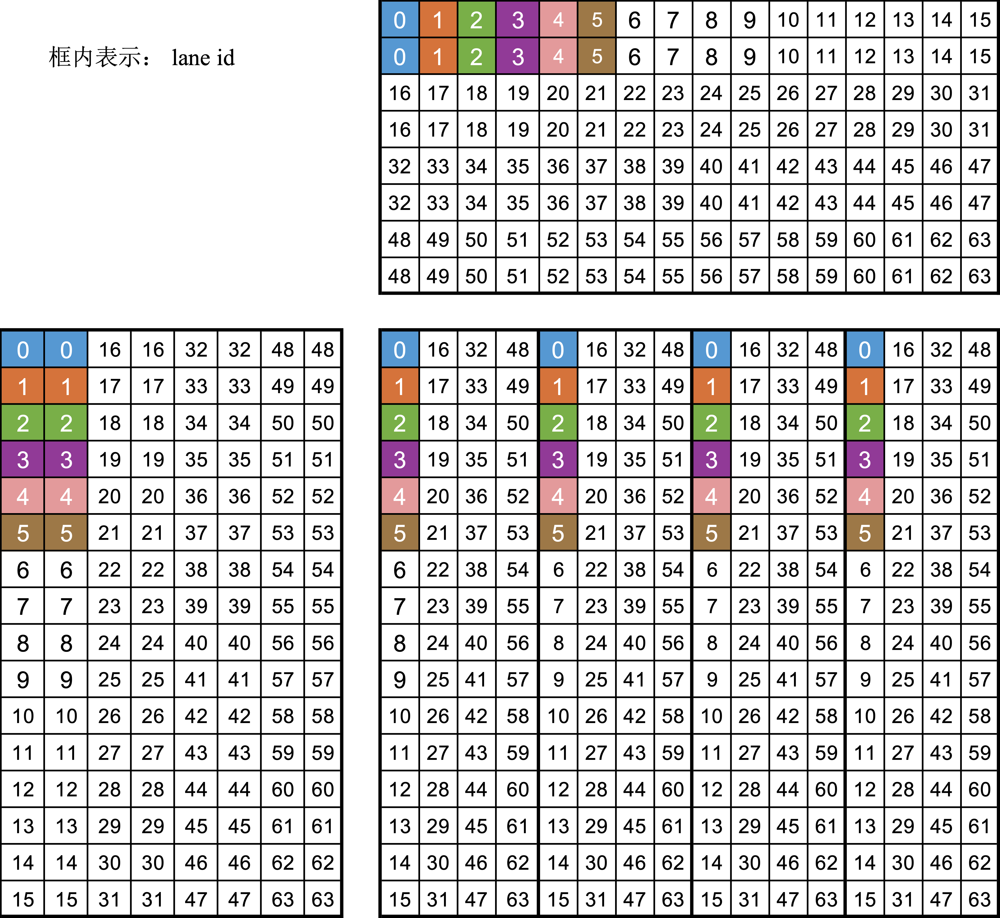

<!-- todo: 预备知识：调度 -->
## Matrix Core 上矩阵乘指令的基本格式

我们考虑矩阵乘：

$$D = A \times B + C$$

其中，A 矩阵是 $M \times K$ 的（M 行、K列，后续记号也是一样的含义）， B 矩阵是 $K \times N$的，
C、D 矩阵都是 $M \times N$ 的。

对应的 API 的格式为： `d = __builtin_amdgcn_mmac_CDFmt_MxNxKABFmt(a, b, c);`
其中，约定如下：
- ABFmt：$A$、$B$ 矩阵中元素的精度，可以是 f16、f32、f64、bf16、tf16、i8、u8 等。
- CDFmt：$C$、$D$ 矩阵中元素的精度，可以是 f16、f32、f64、bf16、tf16、i8、u8 等，如果 CDFmt 和ABFmt 一样，则省略 CDFmt。
- M、N、K：对应上面表述的 A、B、C、D 矩阵的行列数：
    - mA[M][K]: 输入矩阵A；
    - mB[K][N]: 输入矩阵B；
    - mC[M][N]: 累加输入矩阵C；
    - mD[M][N]: 累加结果矩阵D。
- a：向量寄存器（VGPRs），用于存储输入矩阵 A；
- b：向量寄存器（VGPRs），用于存储输入矩阵 B；
- c：向量寄存器（VGPRs），用于存储累加输入矩阵 C；
- d：向量寄存器（VGPRs），用于存储累加结果矩阵 D。

:::info
虽然 AMD 也有[类似的文档](https://rocm.blogs.amd.com/software-tools-optimization/matrix-cores/README.html)，但其指令格式和 DCU 上还是有很多差异（AMD 用的是 MFMA形式，如 `v_mfma_f32_16x16x4_f32`(AMD) vs `v_mmac_16x16x4_f32`(DCU) ），所以本教程适合中国宝宝。
:::

:::note
我们可以看到，相对于AMD 的指令，DCU 上的指令似乎参数要少。
:::

{/* truncate */}

## 示例：v_mmac_16x16x8_f32
<!-- todo: 明确调用的时钟周期 -->
这里，继续以 part1 的 `v_mmac_16x16x8_f32` 指令（对应API：`_builtin_amdgcn_mmac_f32_16x16x8f32`）为例，讲述 Matrix Core 中矩阵乘的执行过程。
因为了解到执行的细节后，才能方便针对架构特点和数据排布的特点开展实现和性能优化。

我们知道，DCU中是 64 个线程组成一个 wavefront（注：词 wavefront 和 warp 偶尔会混用；另：英伟达 GPU 上是 32个线程组成一个 warp）。

依据上面的规则，A、B矩阵分别是 $16 \times 8$ 和 $8\times 16$ 的，C、D 矩阵都是 $16 \times 16$ 大小的， A、B、C、D矩阵中的数据类型都是 f32。

wavefront 内的寄存器 layout 如下：


从上面数据布局的图，可以看出如下的规律
1. A、B、C 矩阵由各个线程贡献部分元素，wavefront 级拼成的逻辑上的矩阵。  
2. A矩阵：平均每个线程两个元素。1）线程间按列优先进行排布；2）线程内部的两个元素，按行优先进行排布。
3. B 矩阵：平均每个线程两个元素。和A矩阵相反，1）线程间按行优先排布；2）线程内的2个元素，按列优先排布。
4. C矩阵：平均每个线程4个元素。

这种布局形式，对设备内存上的数据加载提出了高要求。  
例如，对于 A 矩阵的加载（假设原始数据存在设备内存上）过程，可以看出线程 0 和线程1之间的数据访问并不连续，中间有很大的gap。这就导致其很难直接利用GPU的访存合并特性。一般地，可以考虑以下两种方案：
1. 利用 LDS（即共享内存）进行中间过渡，先将数据“访存合并”地加载到LDS，再从LDS加载到对应的寄存器。  
2. 线程直接访存连续地将数据加载到寄存器，然后采用wavefront级的寄存器通信实现数据重排。
对于数据写回到设备内存中的步骤，也可以采用上述类似的形式进行操作。

## 支持的指令

大家可以拆从 DTK 头文件中，抓取支持的指令。例如 DTK 安装的路径在`/opt/dtk/` 下，那么可以用下面的命令获取不同架构支持的指令：
```bash
grep -nr __builtin_amdgcn_mmac_  /opt/dtk/
```

## 参考资料（AMD）
- https://fs.hlrs.de/projects/par/events/2024/GPU-AMD/day4/20.%20AMD_Matrix_Cores.pdf
- AMD matrix cores 博客: https://rocm.blogs.amd.com/software-tools-optimization/matrix-cores/README.html
- https://gpuopen.com/learn/wmma_on_rdna3/
